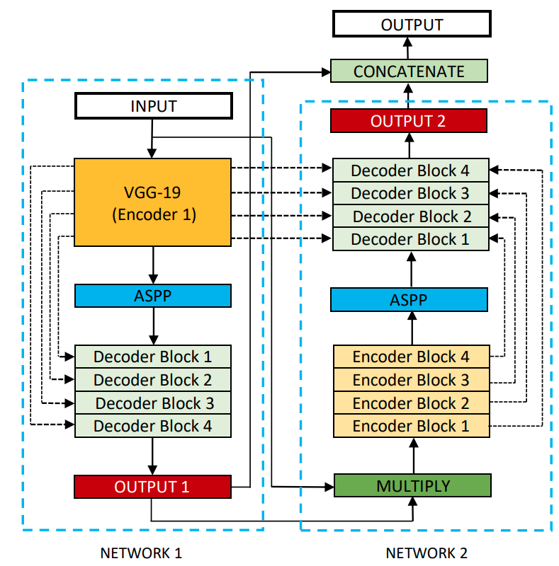

# Tensorflow-Keras Image Segmentation with DoubleU-Net Architecture
This repository contains the modified version of the DoubleU-Net Architecture. The DoubleU-Net is a Deep Convolutional Neural Network created by Debesh Jhay, Michael A. Riegler, Dag Johanseny, Pal Halvorsen, and Havard D. Johanseny for Medical Image Segmentation.

## Paper and Original Code
1. The paper here:
Ieeexplore: [DoubleU-Net: A Deep Convolutional Neural
Network for Medical Image Segmentation](https://ieeexplore.ieee.org/stamp/stamp.jsp?tp=&arnumber=9183321),
Arxiv: [DoubleU-Net: A Deep Convolutional Neural Network for Medical Image Segmentation](https://arxiv.org/pdf/2006.04868.pdf)

2. The original code
Github Repository: [2020 CBMS DoubleU-Net](https://github.com/DebeshJha/2020-CBMS-DoubleU-Net)

## Architecture
The Double-Unet architecture consists of two U-Net architectures whose layers are interconnected at different levels. Each U-Net architecture of the model consists of:
1. Encoder Blocks
2. Atrous/Dilated Spatial Pyramid Pooling (ASPP/DSPP) block
3. Decoder Blocks

The original DoubleU-Net architecture starts with a VGG19 as encoder sub-network, which is followed by decoder sub-network. In the network, the input image is fed to the modified UNet(UNet1), which generates predicted masks (i.e., output1). The authors then multiplied the input image and the produced masks (i.e., output1), which acts as an input for the second modified U-Net(UNet2) that produces another the generated mask (output2). Finally, the authors concatenated both the masks (output1 and output2) to get the final predicted mask (output).

## Major Modifications
The following modifications were made on the initial DoubleU-Net architecture.
1. While the original DoubleU-Net architecture used the VGG19 model as it's first encoder model, the modified version allows its users to use other pre-trained classifications as model encoders. Check the next section for eligible classification models.
2. Also, while the original DoubleU-Net architecture used custom encoder blocks for the encoder function of the second network, the modified version allows it users to use pre-trained functions and weights too.
3. The original DoubleU-Net architecture used a static four blocks for each encoder and decoder functions, while the modified version allows its users to use between 1 and 5 blocks (hence allowing users to determine the optimal amount of parameters that would work for their problems).
4. The original DoubleU-Net architecture multiplied the output (output1) of the first network with its input to form the network 2 input. However, this is only achieveable when the number of input channels is equal to the number of segmentation labels. Hence, the modified version replaced the multiply function with concatenate.
5. The original DoubleU-Net architecture concatenated the outputs of both networks (output1 and output2) to derive the final output. However, this implies that our model output will have double of the number of prediction channels. And while this may be good for visualizing purpose (since we'll have to compress all the channels to one), it'll be difficult to evaluate our model performance, Hence, I replaced the concatenate function with an Add function in the modified version.

## Eligible classification models that can be used as encoder functions:
* DenseNet121, DenseNet169
* EfficientNetB0, EfficientNetB1, EfficientNetB2, EfficientNetB3,
* EfficientNetB4, EfficientNetB5, EfficientNetB6, EfficientNetB7
* MobileNet, MobileNetV2
* ResNet50, ResNet101, ResNet152, ResNet50V2, ResNet101V2, ResNet152V2
* VGG16, VGG19

## Implementation
The DoubleU-Net Architecture can be used as follows:

from model import doubleunet (import the doubleunet architecture from the model file)

model = doubleunet(num_classes,
               input_shape=(224, 224, 3),
               model_weights=None,
               num_blocks=5,
               encoder_one_type='Default',
               encoder_one_weights=None,
               encoder_one_freeze=False,
               encoder_one_filters=[32, 64, 128, 256, 512],
               dspp_one_filters=256,
               decoder_one_type='upsampling',
               num_decoder_one_block_conv_layers=1,
               decoder_one_activation=None,
               decoder_one_use_skip_connection=True,
               decoder_one_use_batchnorm=True,
               decoder_one_dropout_rate=0,
               output_one_activation=None,
               encoder_two_type='Default',
               encoder_two_weights=None,
               encoder_two_freeze=False,
               encoder_two_filters=[32, 64, 128, 256, 512],
               dspp_two_filters=256,
               decoder_two_type='upsampling',
               num_decoder_two_block_conv_layers=1,
               decoder_two_activation=None,
               decoder_two_use_skip_connection=True,
               decoder_two_use_batchnorm=True,
               decoder_two_dropout_rate=0,
               output_two_activation=None)

Where:

<table>
    <tbody>
        <tr>
            <td style="width: 39.1141%;">
                
<strong>Argument</strong>

            </td>
            <td style="width: 60.5856%;">
                
<strong>Description</strong>

            </td>
        </tr>
        <tr>
            <td style="width: 39.1141%;">
                
num_classes

            </td>
            <td style="width: 60.5856%;">
                
The number of the segmentation classes.

            </td>
        </tr>
        <tr>
            <td style="width: 39.1141%;">
                
input_shape

            </td>
            <td style="width: 60.5856%;">
                
A tuple containing image height, width, and channels respectively. Default to (224,224,3).

            </td>
        </tr>
        <tr>
            <td style="width: 39.1141%;">
                
model_weights

            </td>
            <td style="width: 60.5856%;">
                
(Optional) Link to pre-trained weights.

            </td>
        </tr>
        <tr>
            <td style="width: 39.1141%;">
                
num_blocks

            </td>
            <td style="width: 60.5856%;">
                
(Optional) Number of encoder and decoder blocks. Default to 5.

            </td>
        </tr>
        <tr>
            <td style="width: 39.1141%;">
                
encoder_one_type &amp; encoder_two_type

            </td>
            <td style="width: 60.5856%;">
                
Type of model to build upon. One of &apos;Default&apos;, &apos;DenseNet121&apos;, &apos;DenseNet169&apos; &apos;EfficientNetB0&apos;, &apos;EfficientNetB1&apos;, &apos;EfficientNetB2&apos;, &apos;EfficientNetB3&apos;, &apos;EfficientNetB4&apos;, &apos;EfficientNetB5&apos;, &apos;EfficientNetB6&apos;, &apos;EfficientNetB7&apos;, &apos;MobileNet&apos;, &apos;MobileNetV2&apos;, &apos;ResNet50&apos;, &apos;ResNet101&apos;, &apos;ResNet152&apos;, &apos;ResNet50V2&apos;, &apos;ResNet101V2&apos;, &apos;ResNet152V2&apos;, &apos;VGG16&apos;, &apos;VGG19&apos;.

            </td>
        </tr>
        <tr>
            <td style="width: 39.1141%;">
                
encoder_one_weights &amp; encoder_two_weights

            </td>
            <td style="width: 60.5856%;">
                
(Optional) Pre-trained weights for encoder function. One of none (random initialization), &apos;imagenet&apos; (pre-training on imagenet), or the path to the weights file to be loaded.

            </td>
        </tr>
        <tr>
            <td style="width: 39.1141%;">
                
encoder_one_freeze &amp; encoder_two_freeze

            </td>
            <td style="width: 60.5856%;">
                
(Optional) Boolean to specify whether to train encoder model parameters or not. Default is False.

            </td>
        </tr>
        <tr>
            <td style="width: 39.1141%;">
                
encoder_one_filters &amp; encoder_two_filters

            </td>
            <td style="width: 60.5856%;">
                
(Optional) A list containing the number of filters to use for each encoder and decoder block. Default to [32, 64, 128, 256, 512].

            </td>
        </tr>
        <tr>
            <td style="width: 39.1141%;">
                
dspp_one_filters &amp; dspp_two_filters

            </td>
            <td style="width: 60.5856%;">
                
(optional) a list containing the number of filters to use for each DSSP block. Default to 256.

            </td>
        </tr>
        <tr>
            <td style="width: 39.1141%;">
                
decoder_one_type &amp; decoder_two_type

            </td>
            <td style="width: 60.5856%;">
                
(Optional) One of &apos;transpose&apos; (to use Conv2DTanspose operation for upsampling operation) or &apos;upsampling&apos; (to use UpSampling2D operation for upsampling operation). Default to upsampling.

            </td>
        </tr>
        <tr>
            <td style="width: 39.1141%;">
                
num_decoder_one_block_conv_layers &amp; num_decoder_two_block_conv_layers

            </td>
            <td style="width: 60.5856%;">
                
(Optional) The number of convolution layers for each decoder block (i.e., number of Conv2D layers after upsampling layers). Default is 1.

            </td>
        </tr>
        <tr>
            <td style="width: 39.1141%;">
                
decoder_one_activation &amp; decoder_two_activation

            </td>
            <td style="width: 60.5856%;">
                
(Optional) Decoder activation name or function.

            </td>
        </tr>
        <tr>
            <td style="width: 39.1141%;">
                
decoder_one_use_skip_connection &amp; decoder_two_use_skip_connection

            </td>
            <td style="width: 60.5856%;">
                
(Optional) One of True (to use residual/skip connections) or False (not to use residual/skip connections). Default to True.

            </td>
        </tr>
        <tr>
            <td style="width: 39.1141%;">
                
decoder_one_use_batchnorm &amp; decoder_two_use_batchnorm

            </td>
            <td style="width: 60.5856%;">
                
(Optional) Boolean to specify whether decoder layers should use BatchNormalization or not. Default is False.

            </td>
        </tr>
        <tr>
            <td style="width: 39.1141%;">
                
decoder_one_dropout_rate &amp; decoder_two_dropout_rate

            </td>
            <td style="width: 60.5856%;">
                
(Optional) Dropout rate. Float between 0 and 1.

            </td>
        </tr>
        <tr>
            <td style="width: 39.1141%;">
                
output_one_activation &amp; output_two_activation

            </td>
            <td style="width: 60.5856%;">
                
(Optional) Activation for the output layer. Default is either &apos;sigmoid&apos; or &apos;softmax&apos; based on the value of the &apos; num_classes&apos; argument.

            </td>
        </tr>
    </tbody>
</table>

## Additional Functions
In addition to the model, other data preprocessing, prediction and evaluation functions for image segmentation are included in this repository.
### 1. Data Preprocessing Functions
* `list_filepaths`: to aggregate and store file-paths of images and their masks in two lists.
* `data_generator`: to generate TF Dataset from the lists above.

### 2. Model Evaluation
The following evaluation metrics are included in this repository:
* `MultiLabelConfusionMatrix`: Computes Multi-label/Multi-class confusion matrix.
* `IoU`: Computes the Intersection-over-Union (IoU) metric via the confusion matrix.
* `Precision`: Computes the Precision metric via the confusion matrix.
* `Recall`: Computes the Recall metric via the confusion matrix.
* `Specificity`: Computes the Specificity metric via the confusion matrix.
* `Sensitivity`: Computes the Sensitivity metric via the confusion matrix.
* `TDR`: Computes the True-Detection-Rate (TDR) metric via the confusion matrix.
* `F1Score`: Computes the F1Score metric via the confusion matrix.

* `classification_report`: Similar to Sklearn's classification report. Takes true and predicted masks as input and returns classification report containing specified metrics.  

### 3. Mask Prediction with Model
* `predict_mask`: Predicts segmentation labels/masks and returns both the true and predicted masks
* `display`: Displays an image, it's true segmentation label and predicted label.
* `show_predictions`: Displays various images from a TF Dataset, their true segmentation labels and predicted labels.
